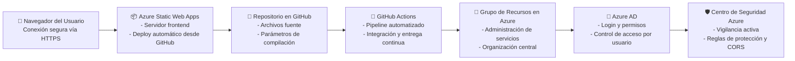

```mermaid
graph LR
    A[👥 Navegador del Usuario\nConexión segura vía HTTPS] --> B[📦 Azure Static Web Apps\n- Servidor frontend\n- Deploy automático desde GitHub]
    B --> C[📂 Repositorio en GitHub\n- Archivos fuente\n- Parámetros de compilación]
    C --> D[🔄 GitHub Actions\n- Pipeline automatizado\n- Integración y entrega continua]
    D --> E[📁 Grupo de Recursos en Azure\n- Administración de servicios\n- Organización central]
    E --> F[🔐 Azure AD\n- Login y permisos\n- Control de acceso por usuario]
    F --> G[🛡 Centro de Seguridad Azure\n- Vigilancia activa\n- Reglas de protección y CORS]
```
